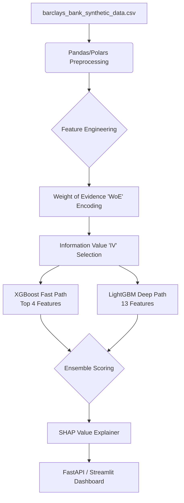

# ML Model Architecture Plan (Hackathon Edition)

This document outlines the lean, high-impact machine learning architecture designed to be built in a compressed hackathon timeframe. It focuses on taking the pristine synthetic dataset (`dataset/barclays_bank_synthetic_data.csv`) and routing it through the pre-delinquency pipeline described in the PRD, specifically focusing on the **XGBoost** and **LightGBM** components.

## 1. Hackathon System Flow

For a hackathon, we bypass heavy infrastructural components (like streaming Kafka or distributed Dask) and emulate the stream using a fast batch-inference FastAPI wrapper to deliver the "wow" factor to the judges.

## 2. Component Design & Libraries

### 2.1 Data Ingestion & Preprocessing
**Goal:** Load the 100k row dataset and prepare it for scoring instantly.
- **Library:** `pandas` (or `polars` for extreme speed-ups during the demo).
- **Actions:** 
  - Fill or impute any introduced nulls.
  - One-hot encode categorical like `employment_category` and `city`.
  - Extract the 13 raw behavioral signals (F1 - F13) directly from the CSV columns.

### 2.2 Feature Engineering (WoE & IV)
**Goal:** Transform raw values to statistically robust risk scores to handle non-linear relationships and outliers cleanly.
- **Library:** `category_encoders` (specifically `category_encoders.woe.WOEEncoder`) or a custom script.
- **Actions:**
  - Map continuous features into 10-20 bins.
  - Calculate Default (Bad) vs Non-Default (Good) distributions per bin.
  - Extract the **Top 4** highly predictive features via IV for the XGBoost Fast Path.

### 2.3 XGBoost Fast Path (The "Green" Gate)
**Goal:** A blazing fast classifier that instantly clears low-risk customers.
- **Library:** `xgboost` (`xgb.XGBClassifier`)
- **Config:** 100 trees (`n_estimators=100`), `max_depth=3`, `learning_rate=0.1`.
- **Logic:** Only uses the Top 4 WoE features. If the Probability of Default (PD) is `< 0.15`, the user is tagged **GREEN** and computation stops.

### 2.4 LightGBM Deep Path & Ensemble
**Goal:** Deep analysis for borderline and risky profiles.
- **Library:** `lightgbm` (`lgb.LGBMClassifier`)
- **Config:** 150 trees, leaf-wise growth, handles all 13 WoE features.
- **Ensemble Logic:** For customers with PD > 0.15 from XGBoost:
  - `Final PD = (XGBoost_PD * 0.4) + (LightGBM_PD * 0.6)`

### 2.5 Explainability (The Killer Hackathon Feature)
**Goal:** Prove to judges that the model complies with SR 11-7 / regulatory explainability standards.
- **Library:** `shap` (`shap.TreeExplainer`)
- **Actions:** Pass the ensemble through SHAP. Output the Top 3 driving features for *why* a customer reached the RED band. 

## 3. Demo Strategy (How to Win)

For the final presentation, don't just show a Jupyter Notebook. Build a `Streamlit` app:
1. **The RM View:** Have a sleek interface where the judge clicks "Simulate Nightly Batch".
2. **The Output:** The app pulls from `dataset/`, runs the XGBoost/LGBM ensemble in seconds.
3. **The Drill-Down:** Click on a "RED" categorized user. The UI expands to show the **SHAP Waterfall Plot**, explaining exactly which behavioral features (e.g., F5 Auto-debit failures + F2 Savings drawdown) triggered the alert.
4. **The Edge-Cases:** Explicitly demo a "Gig Worker" profile getting a fairer score because of the alternate WoE bins, hitting the NIST AI and Consumer Duty talking points from the PRD.
